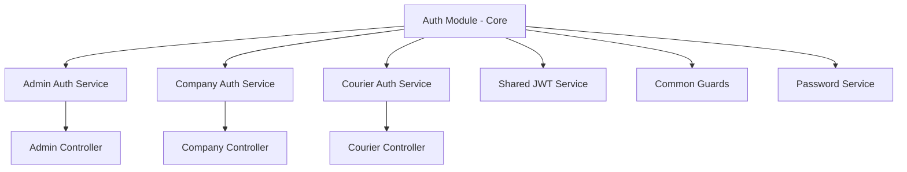

# Authentication ve Role Separation Tasarımı

## 1. Genel Bakış

### Mevcut Durum
Kuryemburada projesinde şu anda admin, firma ve kurye rolleri tek bir auth sistemi üzerinden yönetiliyor. Tüm kullanıcı tipleri aynı `/auth/login` endpoint'ini kullanıyor ve frontend'de role'e göre yönlendirme yapılıyor.

### Hedef Durum
Her rol için ayrı sorumluluklara sahip modüler auth servisleri oluşturmak:
- **Admin Auth Service**: Sistem yöneticileri için özel auth
- **Company Auth Service**: Firma kullanıcıları için özel auth
- **Courier Auth Service**: Kurye kullanıcıları için özel auth

### Faydalar
- **Ayrı Sorumluluklar**: Her servis kendi domain'inin auth logic'ini yönetir
- **Güvenlik**: Role-specific güvenlik kuralları ve validasyonlar
- **Bakım Kolaylığı**: Modüler yapı sayesinde kolay geliştirme ve debug
- **Ölçeklenebilirlik**: Her servis bağımsız olarak geliştirilebilir

## 2. Teknik Mimari

### 2.1 Backend Modül Yapısı



### 2.2 Yeni Modül Organizasyonu

```
backend/src/auth/
├── core/                    # Paylaşılan auth temel servisleri
│   ├── jwt.service.ts      # JWT token yönetimi
│   ├── password.service.ts # Şifre hash/verify
│   ├── base-auth.service.ts # Temel auth fonksiyonları
│   └── guards/
│       ├── jwt-auth.guard.ts
│       └── role-specific.guard.ts
├── admin/                   # Admin özel auth
│   ├── admin-auth.service.ts
│   ├── admin-auth.controller.ts
│   ├── dto/
│   │   └── admin-login.dto.ts
│   └── guards/
│       └── admin-only.guard.ts
├── company/                 # Firma özel auth
│   ├── company-auth.service.ts
│   ├── company-auth.controller.ts
│   ├── dto/
│   │   ├── company-login.dto.ts
│   │   └── company-register.dto.ts
│   └── guards/
│       └── company-only.guard.ts
└── courier/                 # Kurye özel auth
    ├── courier-auth.service.ts
    ├── courier-auth.controller.ts
    ├── dto/
    │   ├── courier-login.dto.ts
    │   └── courier-register.dto.ts
    └── guards/
        └── courier-only.guard.ts
```

## 3. API Endpoint Tasarımı

### 3.1 Yeni Endpoint Yapısı

| Mevcut Endpoint | Yeni Admin Endpoint | Yeni Company Endpoint | Yeni Courier Endpoint |
|----------------|--------------------|-----------------------|----------------------|
| `POST /auth/login` | `POST /auth/admin/login` | `POST /auth/company/login` | `POST /auth/courier/login` |
| `POST /auth/register` | - | `POST /auth/company/register` | `POST /auth/courier/register` |
| `POST /auth/logout` | `POST /auth/admin/logout` | `POST /auth/company/logout` | `POST /auth/courier/logout` |
| `POST /auth/refresh` | `POST /auth/admin/refresh` | `POST /auth/company/refresh` | `POST /auth/courier/refresh` |

### 3.2 Endpoint Detayları

#### Admin Auth Endpoints
```typescript
// POST /auth/admin/login
{
  "email": "admin@kuryem.com",
  "password": "admin123"
}

// Response
{
  "accessToken": "eyJ...",
  "refreshToken": "eyJ...",
  "admin": {
    "id": "uuid",
    "email": "admin@kuryem.com",
    "role": "SUPER_ADMIN",
    "permissions": ["manage_companies", "manage_couriers", "view_reports"]
  }
}
```

#### Company Auth Endpoints
```typescript
// POST /auth/company/login
{
  "email": "firma@test.com",
  "password": "firma123"
}

// POST /auth/company/register
{
  "email": "yenifirma@test.com",
  "password": "password123",
  "companyName": "Test Firma Ltd",
  "phone": "+905551234567",
  "address": {...},
  "contactPerson": {...}
}
```

#### Courier Auth Endpoints
```typescript
// POST /auth/courier/login
{
  "email": "kurye@test.com",
  "password": "kurye123"
}

// POST /auth/courier/register
{
  "email": "yenifirma@test.com",
  "password": "password123",
  "fullName": "Ali Veli",
  "tcNumber": "12345678901",
  "phone": "+905551234567",
  "vehicleInfo": {...},
  "licenseInfo": {...}
}
```

## 4. Service Katmanı Tasarımı

### 4.1 Base Auth Service
```typescript
abstract class BaseAuthService {
  constructor(
    protected prisma: PrismaService,
    protected jwtService: JwtService,
    protected passwordService: PasswordService,
  ) {}

  // Ortak metodlar
  protected async generateTokens(user: any): Promise<AuthTokens>
  protected async validatePassword(plain: string, hashed: string): Promise<boolean>
  protected async revokeRefreshTokens(userId: string): Promise<void>
  
  // Abstract metodlar - her service kendi implementasyonunu yapar
  abstract login(credentials: any): Promise<any>
  abstract register(data: any): Promise<any>
  abstract logout(userId: string): Promise<void>
}
```

### 4.2 Admin Auth Service
```typescript
@Injectable()
export class AdminAuthService extends BaseAuthService {
  async login(credentials: AdminLoginDto): Promise<AdminLoginResponse> {
    // Admin özel login logic
    const admin = await this.validateAdminCredentials(credentials);
    const tokens = await this.generateTokens(admin);
    
    return {
      ...tokens,
      admin: this.transformAdminResponse(admin)
    };
  }

  private async validateAdminCredentials(credentials: AdminLoginDto) {
    const user = await this.prisma.user.findUnique({
      where: { 
        email: credentials.email,
        role: UserRole.SUPER_ADMIN 
      }
    });

    if (!user || user.status !== UserStatus.ACTIVE) {
      throw new UnauthorizedException('Invalid admin credentials');
    }

    const isValidPassword = await this.passwordService.verify(
      credentials.password, 
      user.password
    );

    if (!isValidPassword) {
      throw new UnauthorizedException('Invalid admin credentials');
    }

    return user;
  }
}
```

### 4.3 Company Auth Service
```typescript
@Injectable()
export class CompanyAuthService extends BaseAuthService {
  async login(credentials: CompanyLoginDto): Promise<CompanyLoginResponse> {
    const company = await this.validateCompanyCredentials(credentials);
    const tokens = await this.generateTokens(company);
    
    return {
      ...tokens,
      company: this.transformCompanyResponse(company)
    };
  }

  async register(data: CompanyRegisterDto): Promise<CompanyRegisterResponse> {
    // Email uniqueness check
    await this.checkEmailUniqueness(data.email);
    
    // Transaction ile user + company oluştur
    const result = await this.prisma.$transaction(async (tx) => {
      const user = await tx.user.create({
        data: {
          email: data.email,
          password: await this.passwordService.hash(data.password),
          role: UserRole.COMPANY,
          status: UserStatus.PENDING,
        }
      });

      const company = await tx.company.create({
        data: {
          userId: user.id,
          name: data.companyName,
          phone: data.phone,
          address: data.address,
          contactPerson: data.contactPerson,
          status: CompanyStatus.PENDING,
        }
      });

      return { user, company };
    });

    return this.transformCompanyResponse(result);
  }

  private async validateCompanyCredentials(credentials: CompanyLoginDto) {
    const user = await this.prisma.user.findUnique({
      where: { 
        email: credentials.email,
        role: UserRole.COMPANY 
      },
      include: { company: true }
    });

    if (!user || user.status !== UserStatus.ACTIVE) {
      throw new UnauthorizedException('Invalid company credentials');
    }

    if (!user.company || user.company.status !== CompanyStatus.ACTIVE) {
      throw new ForbiddenException('Company account not approved');
    }

    const isValidPassword = await this.passwordService.verify(
      credentials.password, 
      user.password
    );

    if (!isValidPassword) {
      throw new UnauthorizedException('Invalid company credentials');
    }

    return user;
  }
}
```

## 5. Frontend UI Separation

### 5.1 Mevcut UI Yapısı

Şu anda frontend'de tek bir login sayfası (`/login`) bulunuyor ve tüm kullanıcı tipleri (admin, firma, kurye) aynı formu kullanıyor. AuthContext'te role'e göre yönlendirme yapılıyor.

**Mevcut yapı:**
```
frontend/src/app/
├── (auth)/
│   └── login/           # Tek login sayfası (tüm roller)
├── admin/               # Admin dashboard
├── company/             # Company dashboard  
└── courier/             # Courier dashboard
```

### 5.2 Yeni UI Yapısı

Her rol için ayrı login sayfaları oluşturacağız:

```
frontend/src/app/
├── (auth)/
│   ├── admin/
│   │   └── login/       # Admin özel login
│   ├── company/
│   │   ├── login/       # Firma login
│   │   └── register/    # Firma kayıt
│   ├── courier/
│   │   ├── login/       # Kurye login
│   │   └── register/    # Kurye kayıt
│   └── page.tsx         # Ana login selector sayfası
├── admin/
├── company/
└── courier/
```

### 5.3 Login Selector Page

```typescript
// app/(auth)/page.tsx
export default function AuthSelectorPage() {
  const router = useRouter();

  return (
    <div className="min-h-screen flex items-center justify-center bg-gradient-to-br from-gray-50 to-gray-100">
      <Card className="w-full max-w-lg">
        <CardHeader>
          <CardTitle className="text-3xl font-bold text-center">
            Kurye Operasyon Sistemi
          </CardTitle>
          <CardDescription className="text-center">
            Lütfen hesap tipinizi seçin
          </CardDescription>
        </CardHeader>
        <CardContent className="space-y-4">
          <Button
            onClick={() => router.push('/admin/login')}
            variant="outline"
            className="w-full h-16 text-left justify-start"
          >
            <Shield className="mr-4 h-6 w-6" />
            <div>
              <div className="font-semibold">Sistem Yöneticisi</div>
              <div className="text-sm text-muted-foreground">Admin paneline erişim</div>
            </div>
          </Button>
          
          <Button
            onClick={() => router.push('/company/login')}
            variant="outline"
            className="w-full h-16 text-left justify-start"
          >
            <Building className="mr-4 h-6 w-6" />
            <div>
              <div className="font-semibold">Firma Girişi</div>
              <div className="text-sm text-muted-foreground">Sipariş ve takip işlemleri</div>
            </div>
          </Button>
          
          <Button
            onClick={() => router.push('/courier/login')}
            variant="outline"
            className="w-full h-16 text-left justify-start"
          >
            <Truck className="mr-4 h-6 w-6" />
            <div>
              <div className="font-semibold">Kurye Girişi</div>
              <div className="text-sm text-muted-foreground">Teslimat işlemleri</div>
            </div>
          </Button>
        </CardContent>
      </Card>
    </div>
  );
}
```

### 5.4 Admin Login Page

```typescript
// app/(auth)/admin/login/page.tsx
export default function AdminLoginPage() {
  const router = useRouter();
  const [loading, setLoading] = useState(false);
  const [formData, setFormData] = useState({
    email: "",
    password: "",
  });

  const handleSubmit = async (e: React.FormEvent) => {
    e.preventDefault();
    setLoading(true);
    
    try {
      const response = await AdminAuthService.login(formData);
      AuthService.setTokens(response);
      AuthService.setUser(response.admin);
      
      toast.success('Admin girişi başarılı!');
      router.push('/admin/dashboard');
    } catch (error) {
      toast.error('Giriş başarısız. Admin bilgilerinizi kontrol edin.');
    } finally {
      setLoading(false);
    }
  };

  return (
    <div className="min-h-screen flex items-center justify-center bg-gradient-to-br from-red-50 to-red-100">
      <Card className="w-full max-w-md">
        <CardHeader>
          <div className="flex items-center justify-center mb-4">
            <Shield className="h-12 w-12 text-red-600" />
          </div>
          <CardTitle className="text-2xl font-bold text-center text-red-700">
            Sistem Yöneticisi Girişi
          </CardTitle>
          <CardDescription className="text-center">
            Admin hesabınızla giriş yapın
          </CardDescription>
        </CardHeader>
        <CardContent>
          <form onSubmit={handleSubmit} className="space-y-4">
            {/* Email ve Password inputları */}
            <Button
              type="submit"
              className="w-full bg-red-600 hover:bg-red-700"
              disabled={loading}
            >
              {loading ? 'Giriş yapılıyor...' : 'Admin Girişi'}
            </Button>
          </form>
          
          <div className="mt-4 text-center">
            <Button
              variant="ghost"
              onClick={() => router.push('/auth')}
              className="text-sm"
            >
              ← Geri dön
            </Button>
          </div>
        </CardContent>
      </Card>
    </div>
  );
}
```

### 5.5 Company Login Page

```typescript
// app/(auth)/company/login/page.tsx
export default function CompanyLoginPage() {
  const router = useRouter();
  const [loading, setLoading] = useState(false);
  const [formData, setFormData] = useState({
    email: "",
    password: "",
  });

  const handleSubmit = async (e: React.FormEvent) => {
    e.preventDefault();
    setLoading(true);
    
    try {
      const response = await CompanyAuthService.login(formData);
      AuthService.setTokens(response);
      AuthService.setUser(response.company);
      
      toast.success('Firma girişi başarılı!');
      router.push('/company/dashboard');
    } catch (error) {
      toast.error('Giriş başarısız. Firma bilgilerinizi kontrol edin.');
    } finally {
      setLoading(false);
    }
  };

  return (
    <div className="min-h-screen flex items-center justify-center bg-gradient-to-br from-blue-50 to-blue-100">
      <Card className="w-full max-w-md">
        <CardHeader>
          <div className="flex items-center justify-center mb-4">
            <Building className="h-12 w-12 text-blue-600" />
          </div>
          <CardTitle className="text-2xl font-bold text-center text-blue-700">
            Firma Girişi
          </CardTitle>
          <CardDescription className="text-center">
            Firma hesabınızla giriş yapın
          </CardDescription>
        </CardHeader>
        <CardContent>
          <form onSubmit={handleSubmit} className="space-y-4">
            {/* Email ve Password inputları */}
            <Button
              type="submit"
              className="w-full bg-blue-600 hover:bg-blue-700"
              disabled={loading}
            >
              {loading ? 'Giriş yapılıyor...' : 'Firma Girişi'}
            </Button>
          </form>
          
          <div className="mt-6 text-center space-y-2">
            <p className="text-sm text-muted-foreground">
              Henüz firma hesabınız yok mu?
            </p>
            <Button
              variant="outline"
              onClick={() => router.push('/company/register')}
              className="w-full"
            >
              Firma Kaydı Oluştur
            </Button>
            <Button
              variant="ghost"
              onClick={() => router.push('/auth')}
              className="text-sm"
            >
              ← Geri dön
            </Button>
          </div>
        </CardContent>
      </Card>
    </div>
  );
}
```

### 5.6 Company Register Page

```typescript
// app/(auth)/company/register/page.tsx
export default function CompanyRegisterPage() {
  const router = useRouter();
  const [loading, setLoading] = useState(false);
  const [currentStep, setCurrentStep] = useState(1);
  const [formData, setFormData] = useState({
    // Company basic info
    email: "",
    password: "",
    confirmPassword: "",
    companyName: "",
    phone: "",
    
    // Company details
    taxNumber: "",
    taxOffice: "",
    kepAddress: "",
    
    // Address
    address: {
      city: "",
      district: "",
      neighborhood: "",
      street: "",
      detail: ""
    },
    
    // Contact person
    contactPerson: {
      name: "",
      phone: "",
      email: "",
      title: ""
    }
  });

  const handleSubmit = async (e: React.FormEvent) => {
    e.preventDefault();
    if (formData.password !== formData.confirmPassword) {
      toast.error('Şifreler eşleşmiyor');
      return;
    }

    setLoading(true);
    
    try {
      await CompanyAuthService.register(formData);
      toast.success('Firma kaydınız başarıyla oluşturuldu! Onay bekleniyor.');
      router.push('/company/login');
    } catch (error) {
      toast.error('Kayıt işlemi başarısız. Lütfen bilgilerinizi kontrol edin.');
    } finally {
      setLoading(false);
    }
  };

  return (
    <div className="min-h-screen bg-gradient-to-br from-blue-50 to-blue-100 py-8">
      <div className="container mx-auto px-4">
        <Card className="max-w-2xl mx-auto">
          <CardHeader>
            <CardTitle className="text-2xl font-bold text-center text-blue-700">
              Firma Kaydı
            </CardTitle>
            <CardDescription className="text-center">
              Adım {currentStep}/3: {getStepTitle(currentStep)}
            </CardDescription>
          </CardHeader>
          <CardContent>
            {/* Multi-step form content */}
            <StepIndicator currentStep={currentStep} totalSteps={3} />
            
            <form onSubmit={handleSubmit} className="space-y-6 mt-6">
              {currentStep === 1 && <BasicInfoStep />}
              {currentStep === 2 && <CompanyDetailsStep />}
              {currentStep === 3 && <ContactInfoStep />}
              
              <div className="flex justify-between">
                {currentStep > 1 && (
                  <Button
                    type="button"
                    variant="outline"
                    onClick={() => setCurrentStep(currentStep - 1)}
                  >
                    Geri
                  </Button>
                )}
                
                {currentStep < 3 ? (
                  <Button
                    type="button"
                    onClick={() => setCurrentStep(currentStep + 1)}
                    className="ml-auto"
                  >
                    İleri
                  </Button>
                ) : (
                  <Button
                    type="submit"
                    disabled={loading}
                    className="ml-auto bg-blue-600 hover:bg-blue-700"
                  >
                    {loading ? 'Kayıt oluşturuluyor...' : 'Kaydı Tamamla'}
                  </Button>
                )}
              </div>
            </form>
          </CardContent>
        </Card>
      </div>
    </div>
  );
}
```

### 5.7 Courier Login & Register Pages

```typescript
// app/(auth)/courier/login/page.tsx - Similar structure to company login
// app/(auth)/courier/register/page.tsx - Multi-step form for courier registration
```

### 5.8 Auth Service Refactoring

```typescript
// lib/auth/admin-auth.service.ts
export class AdminAuthService {
  static async login(credentials: AdminLoginDto) {
    const response = await api.post('/auth/admin/login', credentials);
    return response.data;
  }

  static async logout() {
    const response = await api.post('/auth/admin/logout');
    this.clearTokens();
    return response.data;
  }
}

// lib/auth/company-auth.service.ts
export class CompanyAuthService {
  static async login(credentials: CompanyLoginDto) {
    const response = await api.post('/auth/company/login', credentials);
    return response.data;
  }

  static async register(data: CompanyRegisterDto) {
    const response = await api.post('/auth/company/register', data);
    return response.data;
  }
}

// lib/auth/courier-auth.service.ts
export class CourierAuthService {
  static async login(credentials: CourierLoginDto) {
    const response = await api.post('/auth/courier/login', credentials);
    return response.data;
  }

  static async register(data: CourierRegisterDto) {
    const response = await api.post('/auth/courier/register', data);
    return response.data;
  }
}
```

### 5.9 Middleware Güncelleme

```typescript
// middleware.ts
export function middleware(request: NextRequest) {
  const pathname = request.nextUrl.pathname;
  const token = request.cookies.get('accessToken')?.value;
  
  // Ana sayfa yönlendirmesi - role selector'a yönlendir
  if (pathname === '/') {
    return NextResponse.redirect(new URL('/auth', request.url));
  }

  // Auth sayfaları - token varsa role'e göre dashboard'a yönlendir
  if (pathname.startsWith('/auth') && token) {
    const user = getUserFromToken(token);
    return NextResponse.redirect(new URL(getDefaultRoute(user.role), request.url));
  }

  // Role-specific route protection
  const roleRoutes = {
    'super_admin': ['/admin'],
    'company': ['/company'],
    'courier': ['/courier']
  };

  for (const [role, routes] of Object.entries(roleRoutes)) {
    const isRoleRoute = routes.some(route => pathname.startsWith(route));
    
    if (isRoleRoute) {
      if (!token) {
        return NextResponse.redirect(new URL(`/auth/${role}/login`, request.url));
      }

      const user = getUserFromToken(token);
      if (user.role.toLowerCase() !== role) {
        return NextResponse.redirect(new URL('/unauthorized', request.url));
      }
    }
  }

  return NextResponse.next();
}

export const config = {
  matcher: [
    '/',
    '/auth/:path*',
    '/admin/:path*',
    '/company/:path*',
    '/courier/:path*',
  ],
};

function getDefaultRoute(role: string): string {
  switch (role.toLowerCase()) {
    case 'super_admin': return '/admin/dashboard';
    case 'company': return '/company/dashboard';
    case 'courier': return '/courier/dashboard';
    default: return '/auth';
  }
}

function getUserFromToken(token: string): { role: string } {
  try {
    const payload = JSON.parse(atob(token.split('.')[1]));
    return { role: payload.role };
  } catch {
    return { role: '' };
  }
}
```

### 5.10 AuthContext Refactoring

```typescript
// contexts/AuthContext.tsx
export function AuthProvider({ children }: { children: ReactNode }) {
  const [user, setUser] = useState<User | null>(null);
  const [loading, setLoading] = useState(true);
  const router = useRouter();

  // Yeni login metodları
  const adminLogin = async (email: string, password: string) => {
    try {
      const response = await AdminAuthService.login({ email, password });
      handleSuccessfulLogin(response, response.admin, '/admin/dashboard');
    } catch (error) {
      throw new Error('Admin giriş başarısız');
    }
  };

  const companyLogin = async (email: string, password: string) => {
    try {
      const response = await CompanyAuthService.login({ email, password });
      handleSuccessfulLogin(response, response.company, '/company/dashboard');
    } catch (error) {
      throw new Error('Firma giriş başarısız');
    }
  };

  const courierLogin = async (email: string, password: string) => {
    try {
      const response = await CourierAuthService.login({ email, password });
      handleSuccessfulLogin(response, response.courier, '/courier/dashboard');
    } catch (error) {
      throw new Error('Kurye giriş başarısız');
    }
  };

  const handleSuccessfulLogin = (response: any, user: User, redirectPath: string) => {
    AuthService.setTokens({
      accessToken: response.accessToken,
      refreshToken: response.refreshToken
    });
    AuthService.setUser(user);
    setUser(user);
    setAuthStore(user);
    router.push(redirectPath);
  };

  // Eski login metodu (backward compatibility için)
  const login = async (email: string, password: string) => {
    // Email'den role'ü tahmin etmeye çalış veya generic login endpoint'ini kullan
    try {
      const response = await fetch(`${process.env.NEXT_PUBLIC_API_URL}/auth/login`, {
        method: 'POST',
        headers: { 'Content-Type': 'application/json' },
        body: JSON.stringify({ email, password }),
      });
      
      if (!response.ok) throw new Error('Login failed');
      
      const data = await response.json();
      handleSuccessfulLogin(data, data.user, getDefaultRoute(data.user.role));
    } catch (error) {
      throw error;
    }
  };

  return (
    <AuthContext.Provider
      value={{
        user,
        loading,
        login, // Backward compatibility
        adminLogin,
        companyLogin,
        courierLogin,
        logout,
        isAuthenticated: !!user,
        hasRole,
      }}
    >
      {children}
    </AuthContext.Provider>
  );
}
```

## 6. Component Library Enhancement

```typescript
// app/(auth)/login/page.tsx
export default function LoginPage() {
  const [loginType, setLoginType] = useState<'admin' | 'company' | 'courier'>('company');

  const handleLogin = async (credentials: any) => {
    let response;
    
    switch (loginType) {
      case 'admin':
        response = await AdminAuthService.login(credentials);
        break;
      case 'company':
        response = await CompanyAuthService.login(credentials);
        break;
      case 'courier':
        response = await CourierAuthService.login(credentials);
        break;
    }

    // Set tokens and redirect based on role
    AuthService.setTokens(response);
    AuthService.setUser(response.user || response.admin || response.company || response.courier);
    
    router.push(getDefaultRoute(loginType));
  };

  return (
    <div>
      <LoginTypeSelector 
        value={loginType} 
        onChange={setLoginType} 
      />
      <LoginForm 
        type={loginType}
        onSubmit={handleLogin} 
      />
    </div>
  );
}
```

### 5.3 Route Protection Güncelleme

```typescript
// middleware.ts
export function middleware(request: NextRequest) {
  const pathname = request.nextUrl.pathname;
  const token = request.cookies.get('accessToken')?.value;
  
  // Role-based redirections
  if (pathname === '/') {
    if (!token) return NextResponse.redirect(new URL('/login', request.url));
    
    const user = getUserFromToken(token);
    return NextResponse.redirect(new URL(getDefaultRoute(user.role), request.url));
  }

  // Role-specific route protection
  const roleRoutes = {
    admin: ['/admin'],
    company: ['/company'],
    courier: ['/courier']
  };

  for (const [role, routes] of Object.entries(roleRoutes)) {
    const isRoleRoute = routes.some(route => pathname.startsWith(route));
    
    if (isRoleRoute) {
      if (!token) {
        return NextResponse.redirect(new URL('/login', request.url));
      }

      const user = getUserFromToken(token);
      if (user.role.toLowerCase() !== role) {
        return NextResponse.redirect(new URL('/unauthorized', request.url));
      }
    }
  }

  return NextResponse.next();
}

function getDefaultRoute(role: string): string {
  switch (role.toLowerCase()) {
    case 'super_admin': return '/admin/dashboard';
    case 'company': return '/company/dashboard';
    case 'courier': return '/courier/dashboard';
    default: return '/login';
  }
}
```

### 6.1 Paylaşılan Auth Componentleri

```typescript
// components/auth/LoginForm.tsx
interface LoginFormProps {
  type: 'admin' | 'company' | 'courier';
  onSubmit: (credentials: { email: string; password: string }) => Promise<void>;
  loading?: boolean;
}

export function LoginForm({ type, onSubmit, loading = false }: LoginFormProps) {
  const [formData, setFormData] = useState({ email: '', password: '' });
  
  const config = {
    admin: {
      title: 'Sistem Yöneticisi Girişi',
      icon: Shield,
      color: 'red',
      description: 'Admin hesabınızla giriş yapın'
    },
    company: {
      title: 'Firma Girişi',
      icon: Building,
      color: 'blue',
      description: 'Firma hesabınızla giriş yapın'
    },
    courier: {
      title: 'Kurye Girişi',
      icon: Truck,
      color: 'green',
      description: 'Kurye hesabınızla giriş yapın'
    }
  };

  const currentConfig = config[type];
  const Icon = currentConfig.icon;

  return (
    <Card className="w-full max-w-md">
      <CardHeader>
        <div className="flex items-center justify-center mb-4">
          <Icon className={`h-12 w-12 text-${currentConfig.color}-600`} />
        </div>
        <CardTitle className={`text-2xl font-bold text-center text-${currentConfig.color}-700`}>
          {currentConfig.title}
        </CardTitle>
        <CardDescription className="text-center">
          {currentConfig.description}
        </CardDescription>
      </CardHeader>
      <CardContent>
        <form onSubmit={handleSubmit} className="space-y-4">
          <div className="space-y-2">
            <Label htmlFor="email">E-posta</Label>
            <div className="relative">
              <User className="absolute left-3 top-3 h-4 w-4 text-muted-foreground" />
              <Input
                id="email"
                type="email"
                placeholder="ornek@email.com"
                className="pl-10"
                value={formData.email}
                onChange={(e) => setFormData({ ...formData, email: e.target.value })}
                disabled={loading}
                required
              />
            </div>
          </div>
          
          <div className="space-y-2">
            <Label htmlFor="password">Şifre</Label>
            <div className="relative">
              <Lock className="absolute left-3 top-3 h-4 w-4 text-muted-foreground" />
              <Input
                id="password"
                type="password"
                placeholder="••••••••"
                className="pl-10"
                value={formData.password}
                onChange={(e) => setFormData({ ...formData, password: e.target.value })}
                disabled={loading}
                required
              />
            </div>
          </div>

          <Button
            type="submit"
            className={`w-full bg-${currentConfig.color}-600 hover:bg-${currentConfig.color}-700`}
            disabled={loading}
          >
            {loading ? (
              <>
                <Loader2 className="mr-2 h-4 w-4 animate-spin" />
                Giriş yapılıyor...
              </>
            ) : (
              `${type === 'admin' ? 'Admin' : type === 'company' ? 'Firma' : 'Kurye'} Girişi`
            )}
          </Button>
        </form>
      </CardContent>
    </Card>
  );
}

// components/auth/StepIndicator.tsx
export function StepIndicator({ currentStep, totalSteps }: { currentStep: number; totalSteps: number }) {
  return (
    <div className="flex items-center justify-between mb-8">
      {Array.from({ length: totalSteps }, (_, i) => {
        const stepNumber = i + 1;
        const isActive = stepNumber === currentStep;
        const isCompleted = stepNumber < currentStep;
        
        return (
          <div key={stepNumber} className="flex items-center">
            <div
              className={`w-8 h-8 rounded-full flex items-center justify-center text-sm font-medium
                ${isActive ? 'bg-blue-600 text-white' : 
                  isCompleted ? 'bg-green-600 text-white' : 
                  'bg-gray-200 text-gray-600'}`}
            >
              {isCompleted ? <Check className="h-4 w-4" /> : stepNumber}
            </div>
            {stepNumber < totalSteps && (
              <div className={`h-1 w-16 mx-2 ${
                stepNumber < currentStep ? 'bg-green-600' : 'bg-gray-200'
              }`} />
            )}
          </div>
        );
      })}
    </div>
  );
}
```

## 7. Güvenlik Enhancements

### 7.1 Role-Specific Guards

```typescript
// admin/guards/admin-only.guard.ts
@Injectable()
export class AdminOnlyGuard implements CanActivate {
  canActivate(context: ExecutionContext): boolean {
    const request = context.switchToHttp().getRequest();
    const user = request.user;
    
    return user?.role === UserRole.SUPER_ADMIN && user?.status === UserStatus.ACTIVE;
  }
}

// company/guards/company-only.guard.ts
@Injectable()
export class CompanyOnlyGuard implements CanActivate {
  constructor(private prisma: PrismaService) {}

  async canActivate(context: ExecutionContext): Promise<boolean> {
    const request = context.switchToHttp().getRequest();
    const user = request.user;
    
    if (user?.role !== UserRole.COMPANY) return false;

    // Company status kontrolü
    const company = await this.prisma.company.findUnique({
      where: { userId: user.id }
    });

    return company?.status === CompanyStatus.ACTIVE;
  }
}
```

### 7.2 JWT Token Payload Specialization

```typescript
interface AdminTokenPayload {
  sub: string;
  email: string;
  role: 'SUPER_ADMIN';
  permissions: string[];
}

interface CompanyTokenPayload {
  sub: string;
  email: string;
  role: 'COMPANY';
  companyId: string;
  companyStatus: CompanyStatus;
}

interface CourierTokenPayload {
  sub: string;
  email: string;
  role: 'COURIER';
  courierId: string;
  courierStatus: CourierStatus;
}
```

## 8. Mevcut Sistemden Geçiş Stratejisi

### 8.1 Backward Compatibility

```typescript
// Mevcut /auth/login endpoint'ini koruyup yeni sistemlere yönlendir
@Controller('auth')
export class LegacyAuthController {
  @Post('login')
  async legacyLogin(@Body() credentials: any) {
    // Email'den role'ü belirle
    const user = await this.prisma.user.findUnique({
      where: { email: credentials.email }
    });

    if (!user) throw new UnauthorizedException('Invalid credentials');

    // Role'e göre uygun service'i çağır
    switch (user.role) {
      case UserRole.SUPER_ADMIN:
        return this.adminAuthService.login(credentials);
      case UserRole.COMPANY:
        return this.companyAuthService.login(credentials);
      case UserRole.COURIER:
        return this.courierAuthService.login(credentials);
    }
  }
}
```

### 8.2 Migration Steps

1. **Aşama 1**: Yeni auth servislerini oluştur
2. **Aşama 2**: Legacy endpoint'i yeni servislere yönlendir
3. **Aşama 3**: Frontend'i yeni endpoint'leri kullanacak şekilde güncelle
4. **Aşama 4**: Legacy endpoint'i kaldır
5. **Aşama 5**: Test ve optimizasyon

## 9. Testing Strategy

### 9.1 Unit Tests

```typescript
describe('CompanyAuthService', () => {
  it('should login company user successfully', async () => {
    // Test company login
  });

  it('should reject inactive company', async () => {
    // Test inactive company rejection
  });

  it('should register new company', async () => {
    // Test company registration
  });
});
```

### 9.2 Integration Tests

```typescript
describe('Auth Endpoints Integration', () => {
  it('should handle admin login flow', async () => {
    const response = await request(app)
      .post('/auth/admin/login')
      .send(adminCredentials)
      .expect(200);
    
    expect(response.body.accessToken).toBeDefined();
    expect(response.body.admin.role).toBe('SUPER_ADMIN');
  });
});
```


